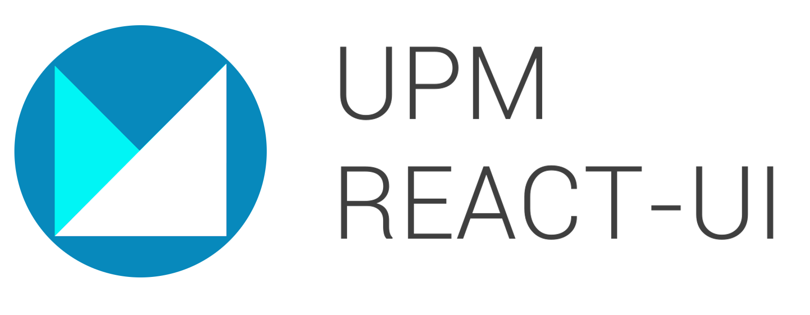

# upm-react-ui
Librería de componentes React basados en [material-ui] v4 (https://v4.mui.com/ogo](./src/images/Logo.png)



## Demo
-- en construcción --

## Installation y ejemplo básico de uso
Hasta tener soporte de un Package Registry en GitLab, la instalación se realiza mediante

```bash
  npm install git@git.upm.es:react/upm-react-ui.git#master --Save~~
```

En el proyecto React importar el componente deseado
```javascript
import { LoadingButton } from 'upm-react-ui'

function App() {
  return <LoadingButton> Botón de prueba </LoadingButton>
}
```

## Desplegar demo en local

Clonar el proyecto
```bash
  git clone "git@git.upm.es:react/upm-react-ui.git"
```

Cambiar al directorio e instalar dependecias

```bash
  cd upm-react-ui
```
```bash
  npm install
```

Cambiar al directorio example e instalar dependencias
```bash
  cd example
```
```bash
  npm install
```

Volver al directorio principal y empaquetar los componentes 
```bash
  npm run watch 
```

Abrir otra terminal y levantar el servidor de la demo desde la carpeta example
```bash
  cd example && npm run start
```

